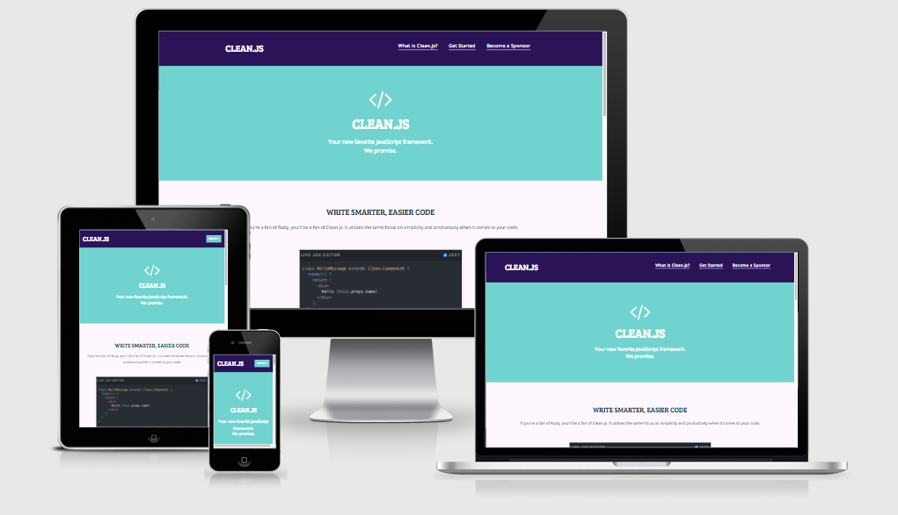

# Clean.js-Website-Example (https://lauramwall.github.io/Clean.js-Website-Example/)

This is a project that I created in my free time for a fictional JavaScript framework. It is meant to exemplify ease of use to developers in their time spent programming.

# Technologies Used

<ul>
  <li>HTML5</li>
  <li>CSS3/SASS</li>
  <li>Bootstrap</li>
  <li>JavaScript/jQuery</li>
  <li>FontAwesome</li>
  <li>Google Font API</li>
  <li>Brackets.io</li>
</ul>

# Screencaps

# Credits

N/A

